# Kino MCP Project

[](https://www.python.org/downloads/)
[](https://nodejs.org/)
[](https://reactjs.org/)
[](https://github.com/fastmcp/fastmcp)
[](https://vitejs.dev/)
[](https://www.sqlalchemy.org/)
[](https://stytch.com/)
[](LICENSE)
[](https://www.pylint.org/)

A simple Model Context Protocol (MCP) implementation featuring a secure FastMCP server with OAuth 2.0 authentication and a modern React frontend. This project demonstrates how to build authentifaction feature when AI assistant tools like Claude Code to authentice user management before using the MCP tools.

## 🎥 See It In Action

Watch the demo video below to see the MCP server in action with authentication:

### Option 1: Download and View Locally
You can download the demo video from the repository:
- **Video File**: [`backend/assets/demo_auth_mcp.mp4`](backend/assets/demo_auth_mcp.mp4) (2.83 MB)
- **Right-click** the link above and select "Save link as..." to download
- **Open** the downloaded file in your video player

### Option 2: View on GitHub
- Navigate to [`backend/assets/demo_auth_mcp.mp4`](backend/assets/demo_auth_mcp.mp4) in the repository
- Click the **"Raw"** button to view the video directly in your browser
- Or use the **"Download"** button to save the file

### Option 3: GitHub Release (Recommended)
The demo video is now available as a GitHub release:
- **🎥 Demo Video**: [Download from GitHub Release](https://github.com/ncmkno/mcp/releases/download/v1.0.0/demo_auth_mcp.mp4)
- **📋 Release Page**: [View Release Details](https://github.com/ncmkno/mcp/releases/tag/v1.0.0)

*Note: The demo shows the authentication flow when using the MCP tools. The video demonstrates how users authenticate through the frontend and then interact with the MCP server tools for note management.*

### Demo Features
- **OAuth Authentication**: Shows the complete authentication flow using Stytch
- **MCP Tool Integration**: Demonstrates how AI assistants can use the authenticated MCP tools
- **Note Management**: Shows creating and retrieving notes through the MCP interface
- **Real-time Interaction**: Demonstrates the seamless integration between frontend auth and backend MCP tools

## 🏗️ System Architecture

The following diagram illustrates the complete architecture and data flow of the Kino MCP Project:

```mermaid
graph TB
    %% External Services
    subgraph "External Services"
        STYTCH[Stytch Auth Service]
        GOOGLE[Google OAuth]
        AI_ASSISTANT["AI Assistant<br/>(Claude, GPT, etc.)"]
    end

    %% Frontend Layer
    subgraph "Frontend (React + Vite)"
        UI[React UI Components]
        AUTH_UI[Stytch Auth UI]
        ROUTER[React Router]
    end

    %% Backend Layer
    subgraph "Backend (FastMCP Server)"
        MCP_SERVER[FastMCP Server]
        AUTH_PROVIDER[BearerAuthProvider]
        NOTE_TOOLS["MCP Tools<br/>• get_my_notes<br/>• add_note"]
        MIDDLEWARE[CORS & Auth Middleware]
    end

    %% Database Layer
    subgraph "Database"
        SQLITE[(SQLite Database)]
        NOTES_TABLE["Notes Table<br/>• id<br/>• user_id<br/>• content"]
    end

    %% Development Tools
    subgraph "Development & Deployment"
        NGROK[ngrok Tunnel]
        UV[uv Package Manager]
        NPM[npm Package Manager]
    end

    %% User Flow
    USER[👤 User] --> UI
    USER --> AUTH_UI

    %% Authentication Flow
    AUTH_UI --> STYTCH
    AUTH_UI --> GOOGLE
    STYTCH --> AUTH_UI
    GOOGLE --> AUTH_UI

    %% Frontend to Backend
    UI --> MCP_SERVER
    AUTH_UI --> MCP_SERVER

    %% Backend Processing
    MCP_SERVER --> AUTH_PROVIDER
    MCP_SERVER --> MIDDLEWARE
    MCP_SERVER --> NOTE_TOOLS

    %% Database Operations
    NOTE_TOOLS --> SQLITE
    SQLITE --> NOTES_TABLE

    %% AI Assistant Integration
    AI_ASSISTANT --> MCP_SERVER
    MCP_SERVER --> AI_ASSISTANT

    %% Development Tools
    MCP_SERVER --> NGROK
    UV --> MCP_SERVER
    NPM --> UI

    %% Styling
    classDef external fill:#e1f5fe,stroke:#01579b,stroke-width:2px
    classDef frontend fill:#f3e5f5,stroke:#4a148c,stroke-width:2px
    classDef backend fill:#e8f5e8,stroke:#1b5e20,stroke-width:2px
    classDef database fill:#fff3e0,stroke:#e65100,stroke-width:2px
    classDef devtools fill:#fce4ec,stroke:#880e4f,stroke-width:2px
    classDef user fill:#f1f8e9,stroke:#33691e,stroke-width:2px

    class STYTCH,GOOGLE,AI_ASSISTANT external
    class UI,AUTH_UI,ROUTER frontend
    class MCP_SERVER,AUTH_PROVIDER,NOTE_TOOLS,MIDDLEWARE backend
    class SQLITE,NOTES_TABLE database
    class NGROK,UV,NPM devtools
    class USER user
```



### Architecture Overview

The system follows a modern microservices architecture with clear separation of concerns:

1. **Frontend Layer**: React application with Stytch authentication UI
2. **Backend Layer**: FastMCP server with OAuth 2.0 authentication
3. **Database Layer**: SQLite with SQLAlchemy ORM
4. **External Services**: Stytch for authentication, Google OAuth integration
5. **AI Integration**: MCP tools accessible to AI assistants
6. **Development Tools**: ngrok for tunneling, uv/npm for package management

### Data Flow

1. **Authentication Flow**: Users authenticate via Stytch/Google OAuth
2. **MCP Tool Access**: AI assistants access authenticated MCP tools
3. **Note Operations**: Create and retrieve user-specific notes
4. **Database Persistence**: SQLite stores user notes with proper indexing

## 🚀 Features

### Backend (FastMCP Server)
- **OAuth 2.0 Authentication**: Secure authentication using Stytch as the identity provider
- **Note Management**: Create, retrieve, and manage user notes through MCP tools
- **SQLite Database**: Lightweight database with SQLAlchemy ORM
- **CORS Support**: Cross-origin resource sharing enabled
- **Type Safety**: Full type hints and comprehensive documentation
- **Professional Code Quality**: Linting with PyLint and comprehensive documentation

### Frontend (React Application)
- **Modern React 19**: Latest features and performance optimizations
- **Vite Build System**: Lightning-fast development and build times
- **Stytch Authentication**: Integration with multiple authentication methods
- **OAuth Support**: Google authentication provider
- **Password Authentication**: Secure login/signup flows
- **Responsive Design**: Modern CSS styling with responsive layouts
- **ESLint Configuration**: Code quality and consistency enforcement
- **Hot Module Replacement (HMR)**: Rapid development experience

## 📋 Prerequisites

- **Python 3.13** or higher
- **Node.js 18** or higher
- **uv** package manager (for Python dependencies)
- **npm** or **yarn** (for Node.js dependencies)
- **Stytch account** and project credentials

## 🛠️ Installation

### 1. Clone the Repository
```bash
git clone <repository-url>
cd mcp
```

### 2. Backend Setup
```bash
cd backend
uv sync
```

Create a `.env` file in the backend directory:
```env
STYTCH_DOMAIN=https://your-project.stytch.com
STYTCH_SECRET=your-secret-key
STYTCH_PROJECT_ID=your-project-id
```

### 3. Frontend Setup
```bash
cd frontend
npm install
```

Update the Stytch public token in `src/main.jsx`:
```javascript
const stytch = createStytchUIClient('your-stytch-public-token');
```

## 🚀 Running the Application

### Backend Server
```bash
cd backend
uv run python3 main.py
```
The server will start on `http://127.0.0.1:8000`

### Frontend Development Server
```bash
cd frontend
npm run dev
```
The application will be available at `http://localhost:5173`

## 🌐 Exposing Your Local Server with ngrok

For API integration and testing with external services, you can expose your local server using ngrok:

1. **Install ngrok** from [https://ngrok.com/download](https://ngrok.com/download)
2. **Authenticate** your ngrok installation:
   ```bash
   ngrok config add-authtoken YOUR_AUTH_TOKEN
   ```
3. **Start your MCP server** (in one terminal):
   ```bash
   cd backend
   uv run python3 main.py
   ```
4. **Start ngrok tunnel** (in another terminal):
   ```bash
   ngrok http 8000
   ```

## 🔧 API Endpoints

### MCP Tools

The server provides the following MCP tools for AI assistants:

#### `get_my_notes()`
Retrieves all notes for the authenticated user.

**Returns**: A formatted string containing all user notes or "no notes found"

#### `add_note(content: str)`
Adds a new note for the authenticated user.

**Parameters**:
- `content` (str): The text content of the note

**Returns**: Confirmation message with the added note content

### OAuth Endpoints

#### `GET /.well-known/oauth-protected-resource`
Provides OAuth metadata for the protected resource.

#### `GET /.well-known/oauth-authorization-server`
Provides OAuth authorization server metadata.

## 🗄️ Database Schema

The application uses SQLite with the following schema:

### Notes Table
```sql
CREATE TABLE notes (
    id INTEGER PRIMARY KEY,
    user_id VARCHAR NOT NULL,
    content TEXT NOT NULL
);
```

**Indexes**:
- `ix_notes_id` on `id`
- `ix_notes_user_id` on `user_id`

## 🏗️ Architecture

### Backend Architecture
- **FastMCP Server**: Main server implementation using FastMCP framework
- **BearerAuthProvider**: OAuth 2.0 authentication provider
- **NoteRepository**: Database operations for notes
- **SQLAlchemy Models**: Database models and session management

### Frontend Architecture
- **React 19**: Modern React with latest features
- **Vite**: Fast build tool and development server
- **Stytch React**: Authentication UI components
- **Stytch Vanilla JS**: Core authentication functionality

### Key Dependencies

#### Backend
- **fastmcp**: MCP server framework
- **python-jose**: JWT token handling
- **sqlalchemy**: Database ORM
- **starlette**: ASGI framework for middleware
- **python-dotenv**: Environment variable management
- **stytch**: Identity provider integration

#### Frontend
- **React 19**: Modern React with latest features
- **React DOM**: React rendering for web
- **Stytch React**: Authentication UI components
- **Stytch Vanilla JS**: Core authentication functionality
- **Vite**: Fast build tool and dev server

## 🔒 Security

- **OAuth 2.0**: Secure authentication using Stytch
- **JWT Tokens**: Stateless authentication with RS256 algorithm
- **CORS**: Configured for cross-origin requests
- **Input Validation**: Type-safe parameter handling
- **Environment Variables**: Secure credential management

## 📁 Project Structure

```
mcp/
├── backend/                # FastMCP server implementation
│   ├── main.py             # Main server file
│   ├── database.py         # Database models and repository
│   ├── database.db         # SQLite database file
│   ├── pyproject.toml      # Python project configuration
│   └── README.md           # Backend documentation
├── frontend/               # React application
│   ├── src/
│   │   ├── App.jsx         # Main application component
│   │   ├── App.css         # Application styles
│   │   ├── main.jsx        # Application entry point
│   │   └── index.css       # Global styles
│   ├── package.json        # Node.js dependencies
│   ├── vite.config.js      # Vite configuration
│   ├── eslint.config.js    # ESLint configuration
│   └── README.md           # Frontend documentation
└── README.md               # This file
```


## 📚 Documentation

- **[Backend Documentation](./backend/README.md)**: Detailed backend setup, API documentation, and usage examples
- **[Frontend Documentation](./frontend/README.md)**: Frontend setup, configuration, and customization guide

## 📄 License

This project is licensed under the MIT License - see the [LICENSE](LICENSE) file for details.

## 🔗 Related Links

- [FastMCP Documentation](https://github.com/fastmcp/fastmcp)
- [Stytch Documentation](https://stytch.com/docs)
- [SQLAlchemy Documentation](https://docs.sqlalchemy.org/)
- [Model Context Protocol](https://modelcontextprotocol.io/)
- [React Documentation](https://reactjs.org/docs/)
- [Vite Documentation](https://vitejs.dev/)
- [ngrok Documentation](https://ngrok.com/)

## 🙏 Acknowledgments

- [Tech with Tim](https://www.youtube.com/c/TechWithTim) for inspiring this project and providing excellent educational content
- [FastMCP](https://github.com/fastmcp/fastmcp) for the excellent MCP server framework
- [Stytch](https://stytch.com/) for authentication infrastructure
- [React](https://reactjs.org/) for the amazing UI library
- [Vite](https://vitejs.dev/) for the excellent build tool
- [SQLAlchemy](https://www.sqlalchemy.org/) for database ORM
- [ngrok](https://ngrok.com/) for secure tunneling 