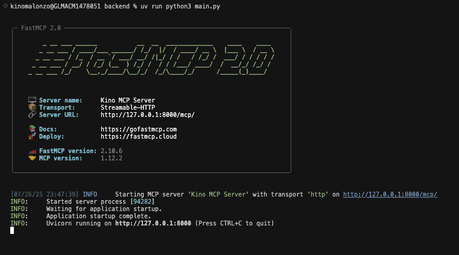
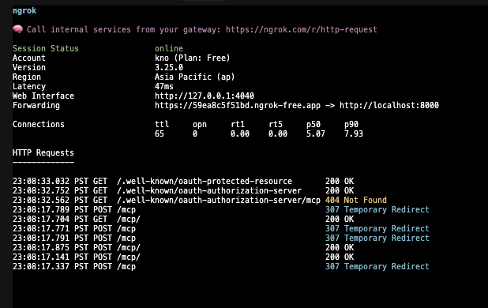

# Kino MCP Server Backend

[](https://www.python.org/downloads/)
[](https://github.com/fastmcp/fastmcp)
[](https://www.sqlalchemy.org/)
[](LICENSE)
[](https://www.pylint.org/)

A secure FastMCP server that provides note management functionality with OAuth 2.0 authentication using Stytch. This server implements the Model Context Protocol (MCP) for AI assistants to interact with user notes through authenticated API endpoints.

> 📖 **See the [main project README](../README.md) for complete project overview and setup instructions.**

## 🚀 Features

- **OAuth 2.0 Authentication**: Secure authentication using Stytch as the identity provider
- **Note Management**: Create, retrieve, and manage user notes
- **SQLite Database**: Lightweight database with SQLAlchemy ORM
- **CORS Support**: Cross-origin resource sharing enabled
- **Type Safety**: Full type hints and documentation
- **Professional Code Quality**: Linting with PyLint and comprehensive documentation

## 📋 Prerequisites

- Python 3.13 or higher
- [uv](https://github.com/astral-sh/uv) package manager
- Stytch account and project credentials

## 🛠️ Installation

1. **Install uv** (if not already installed):
   ```bash
   curl -LsSf https://astral.sh/uv/install.sh | sh
   ```

2. **Clone and navigate to the project**:
   ```bash
   cd backend
   ```

3. **Install dependencies**:
   ```bash
   uv sync
   ```

## ⚙️ Configuration

Create a `.env` file in the backend directory with your Stytch credentials:

```env
STYTCH_DOMAIN=https://your-project.stytch.com
STYTCH_SECRET=your-secret-key
STYTCH_PROJECT_ID=your-project-id
```

## 🚀 Running the Server

### Option 1: Using uv run (Recommended)
```bash
uv run python3 main.py
```



### Option 2: Direct execution (if virtual environment is activated)
```bash
python3 main.py
```

The server will start on `http://127.0.0.1:8000` by default.

## 🌐 Exposing Your Local Server with ngrok

For API integration and testing with external services, you can expose your local server using ngrok. This creates a secure tunnel to your localhost server.

### Installing ngrok

1. **Download ngrok** from [https://ngrok.com/download](https://ngrok.com/download)
2. **Extract and install** the ngrok binary
3. **Sign up** for a free account at [https://ngrok.com](https://ngrok.com)
4. **Authenticate** your ngrok installation:
   ```bash
   ngrok config add-authtoken YOUR_AUTH_TOKEN
   ```

### Running ngrok with Your MCP Server

1. **Start your MCP server** (in one terminal):
   ```bash
   uv run python3 main.py
   ```

2. **Start ngrok tunnel** (in another terminal):
   ```bash
   ngrok http 8000
   ```

3. **Use the ngrok URL** for external API calls:
   - Your local server: `http://127.0.0.1:8000`
   - Public ngrok URL: `https://your-subdomain.ngrok-free.app`



### ngrok Features

- **Real-time monitoring**: View all HTTP requests in the ngrok web interface at `http://127.0.0.1:4040`
- **Request inspection**: See detailed request/response data
- **Secure HTTPS**: Automatic SSL termination
- **Custom domains**: Available with paid plans

### Important Notes

- **Free tier limitations**: ngrok free accounts have session limits and random subdomains
- **Security**: Only use ngrok for development/testing, not production
- **Authentication**: Ensure your MCP server's OAuth endpoints are properly configured for the ngrok domain

## 🔧 API Endpoints

### MCP Tools

The server provides the following MCP tools for AI assistants:

#### `get_my_notes()`
Retrieves all notes for the authenticated user.

**Returns**: A formatted string containing all user notes or "no notes found"

#### `add_note(content: str)`
Adds a new note for the authenticated user.

**Parameters**:
- `content` (str): The text content of the note

**Returns**: Confirmation message with the added note content

## 🎥 Usage Demo

Watch the demo video below to see the MCP server in action:

<video width="100%" controls>
  <source src="assets/demo_auth_mcp.mp4" type="video/mp4">
  Your browser does not support the video tag.
</video>

*Note: The demo shows the authentication when using the MCP tool.*

### OAuth Metadata Endpoint

#### `GET /.well-known/oauth-protected-resource`
Provides OAuth metadata for the protected resource.

**Returns**: JSON object with OAuth configuration details

## 🗄️ Database Schema

The application uses SQLite with the following schema:

### Notes Table
```sql
CREATE TABLE notes (
    id INTEGER PRIMARY KEY,
    user_id VARCHAR NOT NULL,
    content TEXT NOT NULL
);
```

**Indexes**:
- `ix_notes_id` on `id`
- `ix_notes_user_id` on `user_id`

## 🏗️ Architecture

### Core Components

- **FastMCP Server**: Main server implementation using FastMCP framework
- **BearerAuthProvider**: OAuth 2.0 authentication provider
- **NoteRepository**: Database operations for notes
- **SQLAlchemy Models**: Database models and session management

### Key Dependencies

- **fastmcp**: MCP server framework
- **python-jose**: JWT token handling
- **sqlalchemy**: Database ORM
- **starlette**: ASGI framework for middleware
- **python-dotenv**: Environment variable management
- **stytch**: Identity provider integration

## 🔒 Security

- **OAuth 2.0**: Secure authentication using Stytch
- **JWT Tokens**: Stateless authentication with RS256 algorithm
- **CORS**: Configured for cross-origin requests
- **Input Validation**: Type-safe parameter handling

### Database Operations

The `NoteRepository` class provides the following operations:

- `get_notes_by_user_id()`: Retrieve notes by user ID
- `create_note()`: Create a new note
- `delete_note()`: Delete a note by ID
- `get_notes_by_user()`: Alternative method for retrieving user notes

### Error Handling

The application includes comprehensive error handling:
- Database session management with automatic cleanup
- JWT token validation
- Graceful handling of missing notes

## 📁 Project Structure

```
backend/
├── main.py              # FastMCP server implementation
├── database.py          # Database models and repository
├── database.db          # SQLite database file
├── pyproject.toml       # Project configuration and dependencies
├── README.md            # This file
```

## 📄 License

This project is licensed under the MIT License - see the LICENSE file for details.

## 🔗 Related Links

- [FastMCP Documentation](https://github.com/fastmcp/fastmcp)
- [Stytch Documentation](https://stytch.com/docs)
- [SQLAlchemy Documentation](https://docs.sqlalchemy.org/)
- [Model Context Protocol](https://modelcontextprotocol.io/)
- [ngrok Documentation](https://ngrok.com/)
